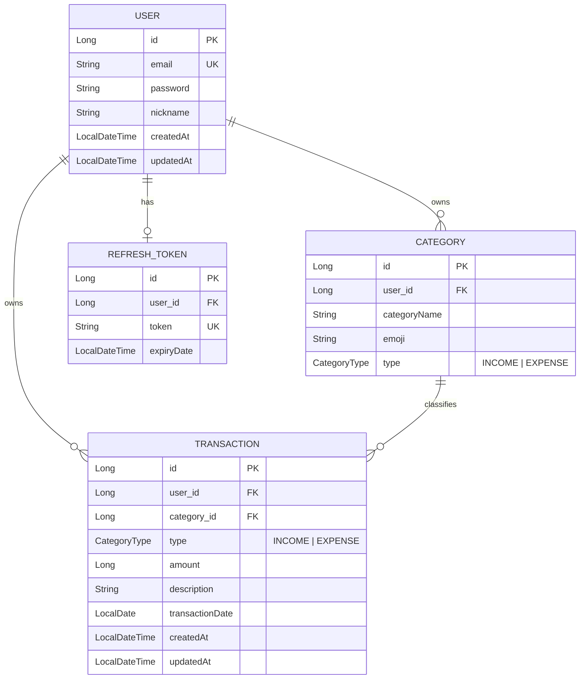

# 머니로그 (MoneyLog) — Backend

개인이 수입·지출을 기록하고 카테고리별·월별 통계를 확인하는 가계부 API 서버입니다.

프론트엔드 리포: [MoneyLog-frontend](https://github.com/kbsjh8870/MoneyLog-frontend)

## 배포 주소

| | URL |
|---|---|
| API (Swagger) | http://3.37.36.180:8080/swagger-ui.html |
| 프론트엔드 | http://3.37.36.180/ |

**테스트 계정**: `demo@moneylog.com` / `demo1234!`

## 주요 기능

- 회원가입 / 로그인 / JWT 재발급 / 로그아웃 (BCrypt, access + refresh 토큰)
- 카테고리 CRUD (가입 시 기본 카테고리 자동 시드)
- 거래내역 CRUD + 월별/유형별/카테고리별 필터링 + 페이징
- 월별 통계 (총수입 · 총지출 · 잔액 · 카테고리별 지출)
- 인가 — 모든 조회/수정/삭제를 본인 데이터로 범위 제한 (IDOR 방지)
- 전역 예외 처리로 통일된 응답 포맷, Swagger 문서화
- Docker + GitHub Actions + EC2 배포
- 내 정보 조회 / 비밀번호 변경 / 회원탈퇴
- 카테고리별 지출 비중 (프론트 파이 차트)

## 기술 스택


## ERD



## API 요약

전체 명세는 Swagger UI에서 확인하세요 (`/swagger-ui.html`). 자주 쓰는 엔드포인트 요약:

| Method | Endpoint | 설명 | 인증 |
|---|---|---|---|
| POST | `/api/auth/signup` | 회원가입 | ✕ |
| POST | `/api/auth/login` | 로그인 (access + refresh 토큰 발급) | ✕ |
| POST | `/api/auth/reissue` | 액세스 토큰 재발급 | ✕ |
| POST | `/api/auth/logout` | 로그아웃 | ✓ |
| GET | `/api/users/me` | 내 정보 조회 | ✓ |
| PATCH | `/api/users/me/password` | 비밀번호 변경 | ✓ |
| DELETE | `/api/users/me` | 회원탈퇴 | ✓ |
| GET/POST | `/api/categories` | 카테고리 목록 조회 / 추가 | ✓ |
| PUT/DELETE | `/api/categories/{id}` | 카테고리 수정 / 삭제 | ✓ |
| GET/POST | `/api/transactions` | 거래 목록 조회(필터·페이징) / 등록 | ✓ |
| GET/PUT/DELETE | `/api/transactions/{id}` | 거래 단건 조회 / 수정 / 삭제 | ✓ |
| GET | `/api/statistics/monthly` | 월별 통계 (`yearMonth` 쿼리 필수) | ✓ |

모든 응답은 `{ success, message, data, meta?, code? }` 형태로 통일되어 있습니다.

## 로컬 실행

기본 프로파일은 `local`이며 H2 인메모리 DB를 사용합니다.

```bash
# .env 파일에 아래 값 준비 후 환경변수로 주입
# JWT_SECRET, JWT_REFRESH

./gradlew bootRun
```

- Swagger UI: `http://localhost:8080/swagger-ui.html`
- H2 콘솔: `http://localhost:8080/h2-console` (JDBC URL: `jdbc:h2:mem:moneylog`)

> `local` 프로파일 기동 시 `DataInitializer`가 데모 데이터를 시드하지만, 시드된 유저의 비밀번호는 평문이라 로그인 테스트에는 쓸 수 없습니다. 실제 로그인 테스트는 `/api/auth/signup`으로 새 계정을 만들어 사용하세요.

## Docker 실행

```bash
docker compose build app   # 로컬 코드 변경분으로 이미지 재빌드
docker compose up -d
```

## 환경 변수

| 변수 | 설명 | 사용 프로파일 |
|---|---|---|
| `JWT_SECRET` | access token 서명 키 (Base64) | 공통 |
| `JWT_REFRESH` | refresh token 서명 키 (Base64) | 공통 |
| `SPRING_DATASOURCE_URL` | MySQL 접속 URL | prod |
| `SPRING_DATASOURCE_USERNAME` | MySQL 사용자 | prod |
| `SPRING_DATASOURCE_PASSWORD` | MySQL 비밀번호 | prod |

## CI/CD

- `main` push → **CI** (`.github/workflows/ci.yml`): 빌드 검증
- CI 성공 → **CD** (`.github/workflows/deploy.yml`): Docker 이미지 빌드 → GHCR push → EC2 SSH 접속 후 `docker compose pull/up`으로 재배포

## 프로젝트 구조

```
src/main/java/org/example/backend/
├── user/          # 회원가입, 로그인, 내 정보, 비밀번호 변경, 회원탈퇴
├── category/       # 카테고리 CRUD
├── transaction/     # 거래내역 CRUD, 필터/페이징
├── statistics/      # 월별 통계
├── security/        # JWT 발급/검증, 인증 필터, 401/403 핸들러
├── global/          # 공통 설정(Security, JPA, QueryDSL), 시드 데이터
└── common/          # 공통 응답 포맷, 커스텀 예외, 에러 코드
```
